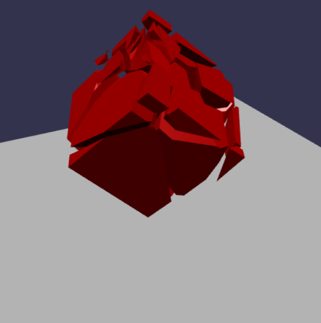

# WebGPU-""Accelerated"" Dynamic Fracture

This is a port of a CIS565 final project by Jiatong He and myself:

> ## [GPU-Accelerated Dynamic Fracture in the Browser - CIS 565 Final Project](https://github.com/kainino0x/cis565final)
> Fall 2014
> 
> Jiatong He, Kai Ninomiya

## Live @ [kai.graphics/webgpu-fracture-hack](https://kai.graphics/webgpu-fracture-hack/)

Works in Chrome 113 on Mac/Windows (in beta; stable release May 2023).
Also works in Chrome Canary on Android, and Chrome Dev on *some* linux systems, with `chrome://flags#enable-unsafe-webgpu`.

Unfortunately, Babylon.js does not yet work in Firefox Nightly at the time of this writing,
but I expect it to work pretty soon!

**This is a hackathon port of a school project, so set your expectations appropriately low.**

It ports:

- From WebCL to WebGPU
- From OpenCL C to WGSL
- From JavaScript/ES5 to TypeScript
- From CubicVR to Babylon.js

Aside from these things, the code is largely the same as the original project.
Please read the write-up there for details of the algorithm.

- It ports one section of a CPU algorithm to the GPU, but in a significantly less efficient way
- Definitely not faster than just running the original algorithm on the CPU even in JavaScript
- Tons of interop overhead due to bringing things back and forth between CPU and GPU
- No GPU-GPU interop between fracture and rendering (despite now using the same `GPUDevice`)
- Actually pretty fast except for the fact that we send horrifyingly overcomplex meshes to the physics engine and it takes a long time to process them (this is what makes the demo slow)
